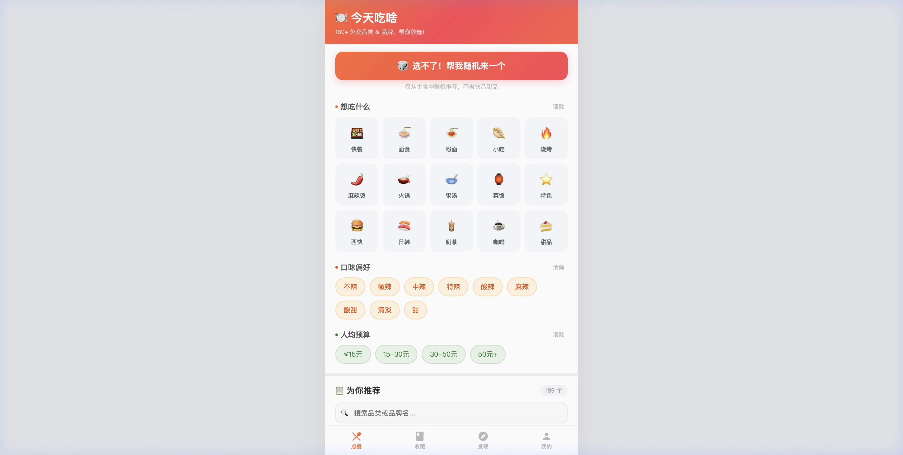

# 🍽️ 今天吃啥 — 外卖选择困难症终结者

> 不知道吃什么？让它帮你选！

一个简洁、无需安装的外卖推荐小工具，帮你**3秒决定今天吃什么**。

## ✨ 预览

  

## 🚀 核心功能

| 功能 | 说明 |
|------|------|
| 🎲 **随机帮选** | 选不了？一键随机推荐主食，老虎机式动画 |
| 🍱 **15大品类** | 快餐、面食、粉面、小吃、烧烤、麻辣烫、火锅、粥汤、菜馆、特色、西式快餐、日韩、奶茶、咖啡、甜品 |
| 🌶 **口味筛选** | 不辣、微辣、中辣、特辣、酸辣、麻辣、酸甜、清淡、甜 |
| 💰 **预算筛选** | ≤15元 / 15-30元 / 30-50元 / 50元+ |
| 🏪 **品牌连锁** | 肯德基、麦当劳、华莱士、老乡鸡、蜜雪冰城、瑞幸、喜茶、海底捞等 50+ 知名品牌 |
| 🔍 **搜索** | 支持品类名、品牌名关键字搜索 |
| 📱 **响应式** | 手机、平板、电脑均可完美使用 |

## 📊 数据覆盖

- **189 个** 外卖品类 & 品牌
- 涵盖：中式快餐、各地面食、粉面米线、街头小吃、烧烤、麻辣烫/冒菜、火锅、粥汤、八大菜系、特色美食、西式快餐、日韩料理
- 饮品：蜜雪冰城、茶百道、古茗、霸王茶姬、喜茶、奈雪、瑞幸、星巴克等 25 个品牌
- 甜品：好利来、鲍师傅、泸溪河、85°C、DQ、哈根达斯等

## 🛠 技术特点

- **纯原生**：HTML5 + CSS3 + JavaScript，零依赖
- **单文件**：一个 `index.html` 搞定一切
- **零 CDN**：不依赖任何外部资源，国内打开飞快
- **离线可用**：下载后双击即可使用，无需联网

## 📦 使用方式

### 方式一：在线访问
直接打开部署后的链接即可使用（手机电脑均可）

### 方式二：本地使用
1. 下载 `index.html` 文件
2. 双击用浏览器打开
3. 开始选择今天吃什么！

## 📄 License

MIT License - 随便用，记得 Star ⭐ 一下~

---

  <b>如果觉得有用，请给个 ⭐ Star 支持一下！</b>

